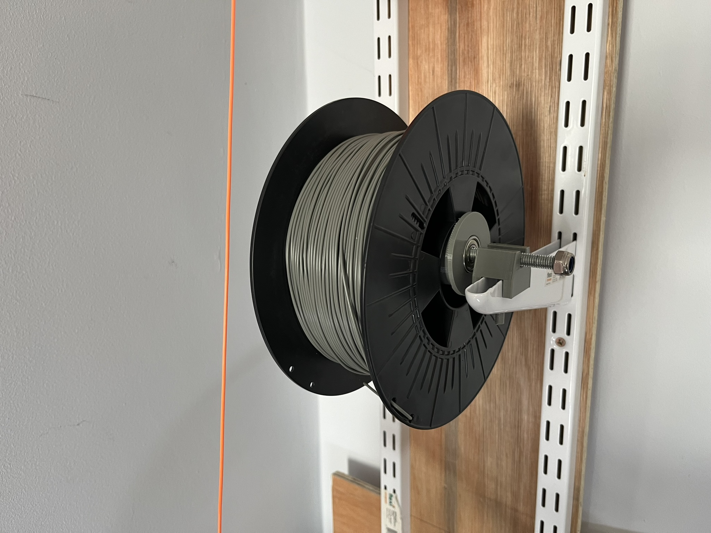

# Spool support for a 3d printer spool.

Designed to sit on shelving rails (mine are from homebase)
Customisable to your needs.

I used 2x 608 bearings that I press fit in the roller and some 8mm threaded rod to go through it.

public domain

